# Network Architecture

## Diagram

```plantuml
@startuml

skinparam backgroundColor #FAFAFA
skinparam defaultFontColor #2D2D2D
skinparam defaultFontName Monospace
skinparam defaultFontSize 11
skinparam ArrowColor #555555
skinparam ArrowThickness 1.5
skinparam shadowing false
skinparam roundCorner 8

skinparam node {
  BackgroundColor #EEF2FF
  BorderColor #7C83D6
  FontStyle bold
}
skinparam rectangle {
  BackgroundColor #F8F9FF
  BorderColor #AAAACC
}
skinparam component {
  BackgroundColor #FFFFFF
  BorderColor #AAAACC
}
skinparam note {
  BackgroundColor #FFFDE7
  BorderColor #F9A825
  FontSize 10
}
skinparam cloud {
  BackgroundColor #E3F2FD
  BorderColor #1976D2
}

title Homelab Network Architecture\n<size:10>(as of 2026-03)</size>

' ─────────────────────────────────────────────────────────────
' PUBLIC INTERNET
' ─────────────────────────────────────────────────────────────
cloud "Internet" as internet

cloud "Starlink\n(CGNAT — no public IPv4)" as starlink
internet --> starlink

' ─────────────────────────────────────────────────────────────
' VPS
' ─────────────────────────────────────────────────────────────
node "Hetzner VPS — Nuremberg\n89.167.62.126 (Debian 13)" as vps {
  component "[UFW]\n allow: 22/tcp  80/tcp  443/tcp\n allow: 51820/udp\n deny: all else" as ufw #D7E8FA
  component "[fail2ban]\n SSH: 5 fails → 1 h ban" as f2b #D7E8FA
  component "[unattended-upgrades]\n daily security-only patches" as uupg #D7E8FA
  component "[Grafana Alloy]\n ships fail2ban / sshd /\n kernel journals → Loki" as alloy #D7E8FA
  component "[nginx — TCP stream]\n 443/tcp → WireGuard tunnel\n 80/tcp  → WireGuard tunnel\n(blind passthrough — no TLS inspection)" as nginx #D7F2E4
  component "[WireGuard wg0]\n 10.100.0.1/24\n PersistentKeepalive=25s" as wg_vps #FFF9C4
}

note right of vps
  **Tier 1 — VPS Hardening**
  UFW: only 4 ports open
  fail2ban: SSH brute-force protection
  unattended-upgrades: auto-patch CVEs
  Alloy: security events shipped to Loki
  nginx: SNI-blind TCP passthrough
  (cannot inspect payload or hostnames)
end note

internet -down-> ufw : HTTPS/TLS\n443 / 80
internet -down-> wg_vps : WireGuard\n51820/udp\n(client VPN)
ufw -down-> nginx
ufw -down-> f2b : triggers ban
ufw ..> wg_vps : allow 51820/udp
nginx -down-> wg_vps : TCP passthrough

' ─────────────────────────────────────────────────────────────
' MIKROTIK ROUTER
' ─────────────────────────────────────────────────────────────
node "MikroTik L009UiGS-2HaxD-IN\nGW: 10.x.0.1 (all VLANs)" as mikrotik {
  component "[WireGuard wg-vps]\n 10.100.0.2/24" as wg_mt #FFF9C4
  component "[Bridge VLAN filtering]\n trunk: ether6\n tagged: VLAN 10 / 20 / 30" as bridge #E8F5E9
  component "[Firewall]\n fw-wg-vps-fwd\n wg-vps → vlan30" as mt_fw #FFECB3
  component "[DHCP servers]\n VLAN 10/20/30\n dns-server: 10.10.20.2" as dhcp #E8F5E9
}

wg_vps <-right-> wg_mt : "WireGuard tunnel\n10.100.0.1 ↔ 10.100.0.2"
wg_mt --> mt_fw
mt_fw --> bridge

' ─────────────────────────────────────────────────────────────
' VLAN 10 — MANAGEMENT
' ─────────────────────────────────────────────────────────────
rectangle "VLAN 10 — Management    10.10.0.0/24" as vlan10 #EDE9FE {

  node "Proxmox VE 9.1\npve01.ruddenchaux.xyz — 10.10.0.2" as proxmox {
    component "[ZFS mirror — SSD]\n rpool (boot + OS)\n 2× 960 GB SAS SSD" as zfs_ssd #F3E8FF
    component "[ZFS mirror — HDD]\n datapool (/datapool)\n 2× 4 TB SAS HDD\n lz4 + atime=off" as zfs_hdd #F3E8FF
    component "[iDRAC 9]\n out-of-band management" as idrac #F3E8FF
  }

  node "AdGuardHome\n10.10.20.2" as adguard {
    component "[Wildcard rewrite]\n *.ruddenchaux.xyz\n → 10.30.0.200 (Traefik)" as dns_rewrite #D7E8FA
    component "[Upstream DNS]\n Starlink 198.54.100.58/59" as dns_up
  }
}

bridge -down-> vlan10 : VLAN 10\ntagged

' ─────────────────────────────────────────────────────────────
' VLAN 20 — TRUSTED LAN
' ─────────────────────────────────────────────────────────────
rectangle "VLAN 20 — Trusted LAN    10.20.0.0/24" as vlan20 #FFF3E0 {
  node "Personal Devices\n(laptop / phone / tablet)" as devices
  node "dev-box (Distrobox)\nFedora Kinoite" as devbox {
    component "Ansible / Terraform\nPacker / kubectl" as iac
  }
}

bridge -down-> vlan20 : VLAN 20\ntagged

' ─────────────────────────────────────────────────────────────
' VLAN 30 — KUBERNETES
' ─────────────────────────────────────────────────────────────
rectangle "VLAN 30 — Kubernetes    10.30.0.0/24" as vlan30 #E8F5E9 {

  node "k8s-ctrl-01    10.30.0.10\n4 vCPU / 8 GB RAM / 20 GB" as ctrl {
    component "kube-apiserver\nkube-scheduler\nkube-controller-manager\netcd" as ctrl_comp
  }

  node "k8s-worker-01    10.30.0.11\n8 vCPU / 16 GB RAM / 50 GB + 500 GB HDD" as w1
  node "k8s-worker-02    10.30.0.12\n8 vCPU / 16 GB RAM / 50 GB + 500 GB HDD" as w2
  node "k8s-worker-03    10.30.0.13\n8 vCPU / 16 GB RAM / 50 GB + 500 GB HDD" as w3

  rectangle "Kubernetes Platform Services" as k8s_platform {

    component "[Cilium CNI]\n Pod CIDR: 10.0.0.0/16\n L2 LoadBalancer IPs:\n 10.30.0.200–250" as cilium #D7E8FA

    component "[Traefik Ingress]\n LoadBalancer: 10.30.0.200\n TLS termination\n internal-allowlist MW" as traefik #D7F2E4

    component "[Authentik SSO]\n auth.ruddenchaux.xyz\n ForwardAuth (*.ruddenchaux.xyz)\n OIDC: Grafana / ArgoCD /\n  Jellyfin / Immich" as authentik #FFECB3

    component "[cert-manager]\n Let's Encrypt (prod + staging)\n DNS-01 via Cloudflare\n Wildcard *.ruddenchaux.xyz" as certmgr #D7E8FA

    component "[Prometheus + Grafana]\n grafana.ruddenchaux.xyz\n kube-prometheus-stack" as monitoring #E8F5E9

    component "[Loki]\n SingleBinary\n 10 Gi PVC (local-path)\n receives: cluster + VPS logs" as loki #E8F5E9

    component "[ArgoCD]\n GitOps — app-of-apps\n argocd.ruddenchaux.xyz\n OIDC via Authentik" as argocd #E8F5E9

    component "[CoreDNS]\n forwards ruddenchaux.xyz\n → AdGuardHome (10.10.20.2)" as coredns #D7E8FA

    component "[local-path-provisioner]\n default StorageClass\n /data/local-path-provisioner\n (worker HDD disks)" as storage #F3E8FF
  }
}

note right of vlan30
  **Layer 3 — Application Security**
  Authentik ForwardAuth on all services
  (except Jellyfin/Seerr/NZBGet — built-in auth)
  cert-manager: TLS everywhere (DNS-01)
  Cilium: network policies, L2 LB
  Traefik internal-allowlist: 10.x.x.x only
  CoreDNS: internal DNS resolution for pods
end note

bridge -down-> vlan30 : VLAN 30\ntagged

' ─────────────────────────────────────────────────────────────
' KEY FLOWS
' ─────────────────────────────────────────────────────────────
' DNS resolution
adguard --> traefik : "*.ruddenchaux.xyz\n→ 10.30.0.200"
coredns --> adguard : "forward ruddenchaux.xyz"

' Ingress flow
traefik --> authentik : ForwardAuth\ncheck
traefik -right-> monitoring : route
traefik -right-> argocd : route
certmgr --> traefik : TLS certificates

' Monitoring / logging
alloy -left-> loki : "VPS security logs\n(fail2ban / sshd / kernel)"
monitoring --> loki : Loki datasource

' Storage
w1 --> storage : local-path PVC
w2 --> storage : local-path PVC
w3 --> storage : local-path PVC

' Proxmox → k8s VMs
proxmox -down-> ctrl : VM 200
proxmox -down-> w1 : VM 201
proxmox -down-> w2 : VM 202
proxmox -down-> w3 : VM 203

' Starlink path
starlink --> mikrotik : uplink

@enduml
```



---

## Network segments

| VLAN | Name | Subnet | Gateway | Purpose |
|------|------|--------|---------|---------|
| 10 | Management | `10.10.0.0/24` | `10.10.0.1` | Proxmox, iDRAC, AdGuardHome |
| 20 | Trusted LAN | `10.20.0.0/24` | `10.20.0.1` | Personal devices, dev-box |
| 30 | Kubernetes | `10.30.0.0/24` | `10.30.0.1` | All k8s VMs + pods |
| — | WireGuard | `10.100.0.0/24` | — | VPS ↔ MikroTik tunnel + VPN clients |

## Key IPs

| Host | IP | Notes |
|------|----|-------|
| MikroTik router | `192.168.88.1` | Default untagged + VLAN gateways |
| Proxmox | `10.10.0.2` | Web UI at `https://10.10.0.2:8006` |
| AdGuardHome | `10.10.20.2` | DNS for all VLANs |
| k8s-ctrl-01 | `10.30.0.10` | kubeadm control plane |
| k8s-worker-01 | `10.30.0.11` | Media stack pinned here |
| k8s-worker-02 | `10.30.0.12` | |
| k8s-worker-03 | `10.30.0.13` | |
| Traefik LB | `10.30.0.200` | All ingress traffic, Cilium L2 |
| LB pool | `10.30.0.200–250` | Cilium L2AnnouncementPolicy |
| VPS | `89.167.62.126` | nginx relay, WireGuard endpoint |
| VPS wg0 | `10.100.0.1` | WireGuard server-side |
| MikroTik wg-vps | `10.100.0.2` | WireGuard client-side |

## Traffic flow — public request (e.g. Jellyfin)

```
Browser
  → DNS: jellyfin.ruddenchaux.xyz → 89.167.62.126 (Cloudflare A record, grey-cloud)
  → VPS:443 — UFW allows, nginx receives
  → nginx TCP stream passthrough (no TLS inspection)
  → WireGuard tunnel (10.100.0.1 → 10.100.0.2)
  → MikroTik firewall (fw-wg-vps-fwd: wg-vps → vlan30)
  → Traefik (10.30.0.200:443) — TLS termination
  → Jellyfin pod (built-in auth, ForwardAuth disabled)
```

## Traffic flow — internal request (e.g. Grafana)

```
Browser (VLAN 20 device)
  → DNS: grafana.ruddenchaux.xyz → 10.30.0.200 (AdGuardHome wildcard)
  → Traefik (10.30.0.200:443) — TLS termination
  → Authentik ForwardAuth check (redirect to auth.ruddenchaux.xyz if unauthenticated)
  → Grafana pod
```

## Security layers

| Layer | Tool | Status |
|-------|------|--------|
| **Tier 1 — VPS** | UFW (ports 22/80/443/51820 only) | ✅ deployed |
| **Tier 1 — VPS** | fail2ban (SSH brute-force, 5 fails → 1 h ban) | ✅ deployed |
| **Tier 1 — VPS** | unattended-upgrades (daily security patches) | ✅ deployed |
| **Tier 1 — VPS** | Grafana Alloy (ships logs to Loki) | ✅ deployed |
| **Tier 1 — VPS** | nginx blind TCP passthrough (no payload inspection) | ✅ deployed |
| **Tier 2 — k8s** | Traefik `internal-allowlist` middleware | ✅ deployed |
| **Tier 2 — k8s** | Traefik rate limiting | ⏳ planned |
| **Tier 2 — k8s** | CrowdSec collaborative IPS | ⏳ planned |
| **Tier 3 — App** | Authentik ForwardAuth (all services) | ✅ deployed |
| **Tier 3 — App** | Authentik OIDC (Grafana, ArgoCD, Jellyfin, Immich) | ✅ deployed |
| **Tier 3 — App** | cert-manager + Let's Encrypt TLS (DNS-01) | ✅ deployed |
| **Tier 3 — App** | VLAN segmentation (mgmt / trusted / k8s isolated) | ✅ deployed |
| **Tier 3 — App** | SSH key-only auth (no password, Proxmox + VMs) | ✅ deployed |

See [`SECURITY.md`](SECURITY.md) for threat model and future hardening plans.
